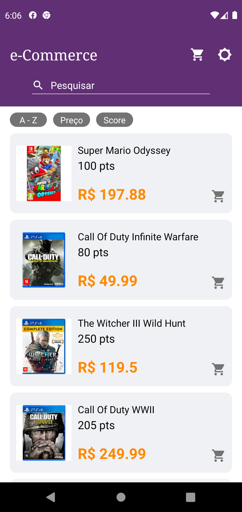
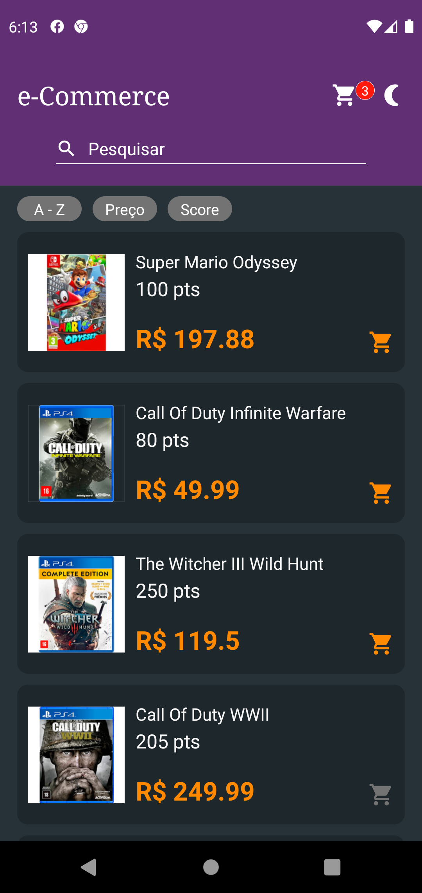
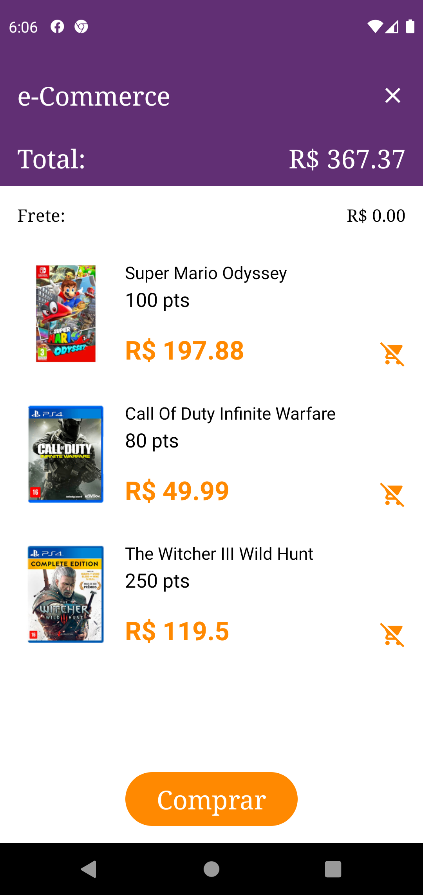
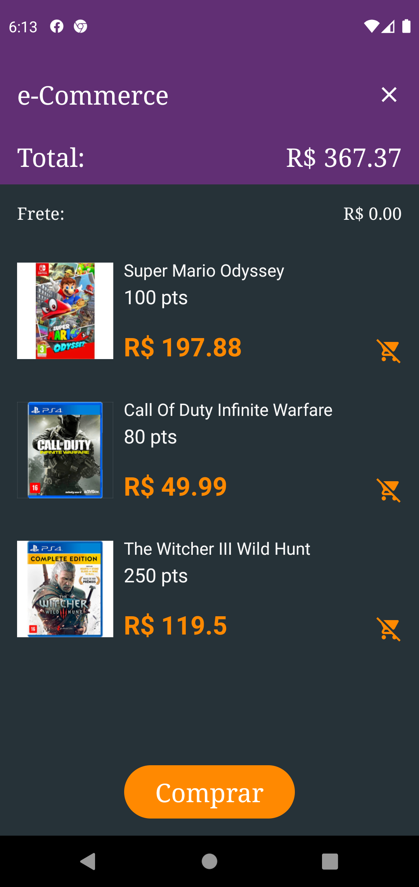

# **Sobre o Projeto**

Aplicatio criado para responder ao desafio proposto pela Supera Tecnologia, que consiste em construir a interface de um ecommerce de games utilizando ReactJs ou React Native.

### **Feito Com**

- [React Native](http://facebook.github.io/react-native/)
- [React Navigation](https://reactnavigation.org/)
- [Styled Components](https://styled-components.com)
- [React Native Elements](https://reactnativeelements.com)

### **Funcionalidades**

- [x] Listagem de produtos
- [x] Adição e remoção de produtos do carrinho
- [x] Pesquisa por nome
- [x] Ordenação dos produtos por nome, preço e score
- [x] Temas escuro e claro

## **Capturas de Tela**

### **Lista de Produtos**

  

### **Carrinho**

  
